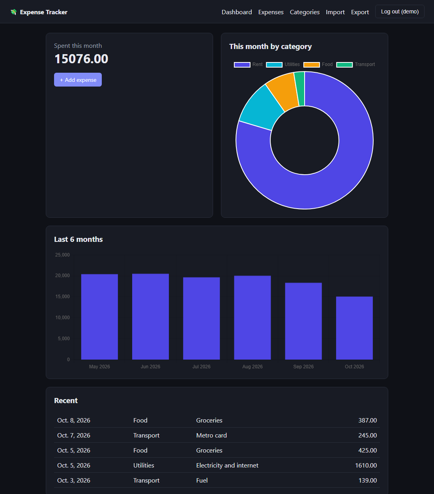
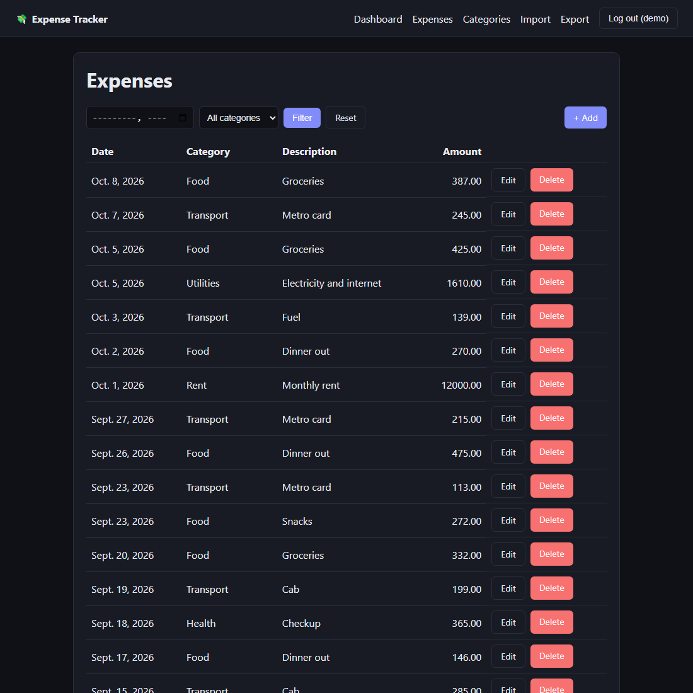

# Expense Tracker

A multi-user Django app to log expenses, organise them by category, and see where the money goes, with a charts dashboard and CSV import/export.



<details>
<summary>More screenshots</summary>



</details>

*Screenshots use made-up demo data.*

## Features
- **Accounts:** sign up and log in; every user sees only their own data (other users' records return 404)
- **Expenses:** add, edit and delete; filter by month and category; paginated list
- **Categories:** personal categories per user (case-insensitive, no duplicates)
- **Dashboard:** this month's total, spending by category (doughnut chart) and the last 6 months (bar chart)
- **CSV import / export:** valid rows are imported even if others fail, and every bad row is reported with its line number
- **Tested:** 21 automated tests covering permissions, validation, dashboard maths and CSV round-trips

## Tech stack
Python, Django 6, SQLite, Chart.js (loaded from a CDN), Django's built-in authentication.

## Quick start
Requires Python 3.12+.

```bash
git clone https://github.com/ChakshitGaur/expense-tracker.git
cd expense-tracker
python -m venv .venv
.venv\Scripts\activate          # macOS/Linux: source .venv/bin/activate
pip install -r requirements.txt
copy .env.example .env          # macOS/Linux: cp .env.example .env
python manage.py migrate
python manage.py runserver
```

Open http://127.0.0.1:8000 and sign up. To try the CSV import, upload `samples/sample_expenses.csv` from the **Import** page.

## Configuration
Settings are read from environment variables or a git-ignored `.env` file (see `.env.example`):

| Variable | Purpose |
|---|---|
| `DJANGO_DEBUG` | `1` for local development. Leave unset (or `0`) in production. |
| `DJANGO_SECRET_KEY` | Required whenever `DJANGO_DEBUG` is not `1`. The app refuses to start without it. |
| `DJANGO_ALLOWED_HOSTS` | Comma-separated host names (default `localhost,127.0.0.1`). |

Never commit `.env` or `db.sqlite3`.

## Run the tests
```bash
python manage.py test
```

## CSV format
Columns: `date` (YYYY-MM-DD), `amount` (positive number), `category` (optional), `description` (optional). Unknown categories are created automatically. Importing the same file twice adds the rows twice.

## Project layout
| Path | What it does |
|---|---|
| `expenses/models.py` | `Category` and `Expense` models |
| `expenses/services.py` | Dashboard aggregation and CSV logic (no HTTP code, easy to test) |
| `expenses/views.py`, `forms.py`, `urls.py` | The web layer |
| `expenses/templates/` | HTML templates |
| `samples/` | Example CSV |

## Ideas for next steps
- REST API with token authentication
- Per-category monthly budgets with warnings
- Spending forecast for next month
- GitHub Actions to run the tests on every pull request
